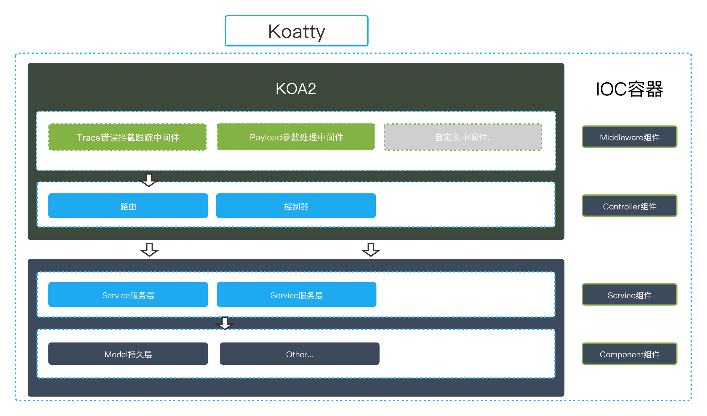

# Koatty
Koa2 + Typescript = Koatty. 

Use Typescript's decorator implement IOC and AOP, just like SpringBoot.

Koatty是基于Koa2实现的一个具备IOC自动依赖注入以及AOP切面编程的敏捷开发框架，用法类似SpringBoot。

[](https://www.npmjs.com/package/koatty)[](https://npmcharts.com/compare/koatty?minimal=true)

# 快速开始

## 第一个应用

### 1.安装命令行工具

```bash
npm i -g koatty_cli
```
命令行工具的版本同Koatty框架的版本是对应的，例如 koatty_cli@1.11.x 支持 koatty@1.11.x版本的新特性。

### 2.新建项目

```bash
koatty new projectName

cd ./projectName

yarn install


```

### 3.启动服务
```bash
// dev模式
npm run dev

// pro模式
npm start

```

 浏览器中访问  `http://localhost:3000/`. 

## 调试模式

墙裂推荐使用Visual Studio Code(简称 VScode)进行开发, 编辑项目目录下的 .vscode/launch.json文件（点击调试-配置也可以打开）:

```js
{
    "version": "0.2.0",
    "configurations": [
        {
            "type": "node",
            "request": "launch",
            "name": "TS Program",
            "args": [
                "${workspaceRoot}/src/App.ts" 
            ],
            "runtimeArgs": [
                "--nolazy",
                "-r",
                "ts-node/register"
            ],
            "sourceMaps": true,
            "cwd": "${workspaceRoot}",
            "protocol": "inspector",
            "internalConsoleOptions": "neverOpen"
        }
    ]
}
```

选择 `TS Program` 以debug模式启动.

# 基础功能

## 项目结构

Koatty的命令行工具`koatty_cli`在创建项目的时候，默认会形成以下目录结构:

 ```bash
<projectName>
├── .vscode                       # vscode配置
│   └── launch.json               # node本地调试脚本
├── dist                          # 编译后目录
├── src                           # 项目源代码
│   ├── config
│   │   ├── config.ts             # 框架配置
│   │   ├── db.ts                 # 存储配置
│   │   ├── middleware.ts         # 中间件配置
│   │   ├── plugin.ts             # 插件配置
│   │   └── router.ts             # 路由配置
│   ├── controller                # 控制器
│   │   └── TestController.ts
│   ├── middleware                # 中间件
│   │   ├── JwtMiddleware.ts
│   │   └── ViewMiddleware.ts
│   ├── model                     # 持久层
│   │   └── TestModel.ts
│   ├── plugin                    # 插件
│   │   └── TestPlugin.ts
│   ├── proto                     # pb协议
│   │   └── helloworld.proto
│   ├── resource                  # 用于存放静态数据或白名单等
│   │   └── data.json
│   ├── service                   # service逻辑层
│   │   └── TestService.ts
│   ├── utils                     # 工具函数
│   │   └── index.ts
│   └── App.ts                    # 入口文件
├── static                        # 静态文件目录
│   └── index.html
├── test                          # 测试用例
│   └── index.test.js
├── apidoc.json
├── pm2.json
├── package.json
├── README.md
└── tsconfig.json
 ```

但是Koatty支持灵活的自定义项目结构，除配置目录(通过@ConfiguationScan()定制)以及静态资源目录(需要修改Static中间件默认配置)以外，其他目录名称、结构等都可以自行定制。

## 入口文件

Koatty默认的入口文件是 `App.ts`，内容如下：

```js
import { Koatty, Bootstrap } from "koatty";
// import * as path from "path";

@Bootstrap(
    //bootstrap function
    // (app: any) => {
    //调整libuv线程池大小
    // process.env.UV_THREADPOOL_SIZE = "128";
    //忽略https自签名验证
    // process.env.NODE_TLS_REJECT_UNAUTHORIZED = '0';
    // }
)
// @ComponentScan('./')
// @ConfiguationScan('./config')
export class App extends Koatty {
    public init() {
        // this.appDebug = true; //线上环境请将debug模式关闭，即：appDebug:false
    }
}
```

App类继承于Koatty类，而Koatty是对于Koa的继承和扩展。因此可以认为App类的实例就是koa类的实例(进行了扩展) app对象。

Koatty通过`@Bootstrap()`装饰器来定义项目入口，`@Bootstrap()`可以接受函数作为参数，该函数在项目加载启动过程中，通过`appReady`事件触发执行。

如果修改了项目目录或者想排除某些目录Bean不自动进行加载，可以通过`@ComponentScan()`装饰器进行定制。

`@ConfiguationScan()`装饰器用于定制项目配置文件目录。

`appDebug` 值为`true`时，nodeEnv环境在 `development` 模式。并且控制器打印详细的日志信息。

## 基础对象

### App

App 是全局应用对象，在一个应用中，只会实例化一个，它继承自 Koa.Application，在它上面我们可以挂载一些全局的方法和对象。我们可以轻松的在插件或者应用中扩展 App 对象。

在`CONTROLLER`,`SERVICE`,`COMPONENT`类型bean中默认已经注入了App对象，可以直接进行使用:

```js
@Controller()
export class TestController extends BaseController {
    ...

    test() {
        //打印app对象
        console.log(this.app);
    }
}
```

在`MIDDLEWARE`类型bean中，App对象作为函数入参传递：

```js
@Middleware()
export class TestMiddleware implements IMiddleware {
    run(options: any, app: Koatty) {
        ...
        //打印app对象
        console.log(app);
    }
}
```

### Ctx

Ctx 是一个请求级别的对象，继承自 Koa.Context。在每一次收到用户请求时，框架会实例化一个 Ctx 对象，这个对象封装了这次用户请求的信息，并提供了许多便捷的方法来获取请求参数或者设置响应信息。

在 `CONTROLLER`类型bean中，Ctx对象作为成员属性。可以直接使用：

```js
@Controller()
export class TestController extends BaseController {
    ...

    test() {
        //打印ctx对象
        console.log(this.ctx);
    }
}
```

在`MIDDLEWARE`类型bean中，Ctx对象作为中间件执行函数入参传递：

```js
@Middleware()
export class TestMiddleware implements IMiddleware {
    run(options: any, app: Koatty) {
        ...
        
        return async function (ctx: any, next: any) {
            
            //打印ctx对象
            console.log(ctx);

            return next();
        };
    }
}

```

在`SERVICE`,`COMPONENT`类型bean中，Ctx对象需要自行传递。

## 配置

实际项目中，肯定需要各种配置，包括：框架需要的配置以及项目自定义的配置。Koatty 将所有的配置都统一管理，并根据不同的功能划分为不同的配置文件。

* config.ts 通用的一些配置
* db.ts 数据库配置
* router.ts 路由配置
* middleware.ts 中间件配置
* plugin.ts 插件配置

除上述常见的配置文件之外，Koatty也支持用户自行定义的配置文件命名。


### 自定义配置扫描路径

配置文件默认放在 src/config/ 目录下，我们还可以通过在入口文件App.ts类自定义配置扫描路径：

```js
//App.ts

@ConfiguationScan('./myconfig')
export class App extends Koatty {

    public init() {
        ...
    }
}
```

Koatty启动时会自动扫描项目 src/myconfig目录下所有文件(.ts),按照文件名分类加载为配置

### 配置文件格式

Koatty的配置文件必须是标准的ES6 Module格式进行导出,否则会无法加载。格式如下：

```js
export default {
    /*database config*/
    database: {
        db_type: 'mysql', //support  postgresql,mysql...
        db_host: '127.0.0.1',
        db_port: 3306,
        db_name: 'test',
        db_user: 'test',
        db_pwd: '',
        db_prefix: '',
        db_charset: 'utf8'
    }
}

```

### 读取配置

在项目中有两种方式可以很方便的读取配置：

* 方式一(控制器、service等含有app属性的类中使用):

```js
//
...
const conf: any = this.app.config("test");

```
* 方式二(利用装饰器进行注入，推荐用法)

```js
@Controller()
export class AdminController {
    @Value("test")
    conf: any;
}

```
### 配置分类及层级

Koatty在启动扫描配置文件目录时，会按照文件名对配置进行分类。例如：db.ts加载完成后，读取该文件内的配置项需要增加类型

```js
// config函数的第二个参数为类型
const conf: any = this.app.config("test", "db");

或者

@Value("test", "db")
conf: any;

```

Koatty在读取配置时支持配置层级，例如配置文件db.ts：

```js
export default {
    /*database config*/
    database: {
        db_type: 'mysql', //support  postgresql,mysql...
        db_host: '127.0.0.1',
        db_port: 3306,
        db_name: 'test',
        db_user: 'test',
        db_pwd: '',
        db_prefix: '',
        db_charset: 'utf8'
    }
}
```

读取 `db_host`的值：

```js
@Value("database.db_host", "db")
dbHost: string;

或者

const dbHost: string = this.app.config("database.db_host", "db");

```


需要特别注意的是，层级配置仅支持直接访问到`二级`，更深的层级请赋值后再次获取:

```js
//config
export default {
    test: {
        bb: {
            cc: 1
        }
    }
}

const conf: any = this.app.config("test");
const cc: number = conf.bb.cc;
```

### 运行环境配置

Koatty可以自动识别当前运行环境，并且根据运行环境自动加载相应配置（如果存在）。

运行环境由三个属性来进行定义：

* appDebug

	在项目入口文件的构造方法（init）内进行定义

```js
//App.ts
@Bootstrap()
export class App extends Koatty {
    public init() {
        //appDebug值为true时，development模式
        //appDebug值为false时，production模式
        this.appDebug = false;
    }
}
```

* process.env.NODE_ENV

	Node.js的运行时环境变量，可以在系统环境定义，也可以在项目入口文件启动函数中定义

* process.env.KOATTY_ENV

	Koatty框架运行时环境变量


三者之间的关系和区别：

| 变量                   | 取值                   | 说明                  | 优先级 |
| ---------------------- | ---------------------- | --------------------- | ------ |
| appDebug               | true/false             | 调试模式              | 低     |
| process.env.NODE_ENV   | development/production | Node.js运行时环境变量 | 中     |
| process.env.KOATTY_ENV | 任意字符               | 框架运行时环境变量    | 高     |


这里的优先级指加载运行时相应配置文件的优先级。

例如：

- `process.env.KOATTY_ENV=pro`,会自动加载带`_pro.ts`后缀的配置文件。

- `process.env.KOATTY_ENV`没有配置，如果`process.env.NODE_ENV=production`,会自动加载带`_production.ts`后缀的配置文件。

- 如果`process.env.KOATTY_ENV`以及`process.env.NODE_ENV`都没有配置，则看`appDebug`的值，为true时，`process.env.NODE_ENV`自动赋值为development，为false时赋值为production，相应加载的配置文件也遵循`_development.ts`或`_production.ts`后缀

通过对这三个变量的灵活配置，可以支持多样化的运行环境及配置

### 常用的环境变量

* process.env.ROOT_PATH

Koatty定义的项目根目录，在项目中任何地方均可使用。

* process.env.APP_PATH

Koatty定义的项目应用目录(调试模式下启动，值为/`projectDIR`/src；在生产模式下启动，值为/`projectDIR`/dist)，在项目中任何地方均可使用。

* process.env.THINK_PATH

Koatty定义的框架根目录(/`projectDIR`/node_modules/koatty/)，在项目中任何地方均可使用。

* process.env.LOGS_PATH

Koatty定义的日志保存目录(默认为/`projectDIR`/logs，可在配置中修改)，在项目中任何地方均可使用。


## 路由

Koatty 通过RequestMapping类型装饰器进行路由注册，使用[@koa/router](https://github.com/koajs/router)进行路由解析。

### 控制器路由

`@Controller()`装饰器的参数作为控制器访问入口，参数默认值为`/`。然后再遍历该控制器的方法上的装饰器GetMaping、
DeleteMaping、PutMaping、PostMaping等进行方法路由注册。

例如：
```js
@Controller("/admin")
export class AdminController extends BaseController {
    ...
    @GetMapping("/test")
    test(){
        ...
    }
    ...
}
```
上述代码注册了路由 `/admin/test` ==> AdminController.test();

### 方法路由

用于控制器方法绑定路由 [参考装饰器章节](##MethodDecorator方法装饰器)

方法路由的装饰器有 `GetMapping`、`PostMapping`、`DeleteMapping`、`PutMapping`、`PatchMapping`、`OptionsMapping`、`HeadMapping`

### 路由配置

在项目 src/config/router.ts存放着路由自定义配置，该配置用于初始化`@koa/router`实例，作为**构造方法入参**使用，具体配置项请参考 [@koa/router](https://github.com/koajs/router)。

```js
    prefix: string;
    /**
     * Methods which should be supported by the router.
     */
    methods ?: string[];
    routerPath ?: string;
    /**
     * Whether or not routing should be case-sensitive.
     */
    sensitive ?: boolean;
    /**
     * Whether or not routes should matched strictly.
     *
     * If strict matching is enabled, the trailing slash is taken into
     * account when matching routes.
     */
    strict ?: boolean;
```

### 路由特点

* @Controller()装饰器有两个作用，一是声明bean的类型是控制器；二是绑定控制器路由。如果使用@Controller()装饰器的时候没有指定path(没有参数)，默认参数值为"/"

* 路由装饰器（包括`RequestMapping`、`GetMapping`、`PostMapping`、`DeleteMapping`、`PutMapping`、`PatchMapping`、`OptionsMapping`、`HeadMapping`）仅可用于装饰控制器类的方法。

* 路由装饰器（包括`RequestMapping`、`GetMapping`、`PostMapping`、`DeleteMapping`、`PutMapping`、`PatchMapping`、`OptionsMapping`、`HeadMapping`）可以给同一个方法添加多次。但是@Controller()装饰器同一个类仅能使用一次。

* 如果绑定的路由存在重复，按照IOC容器中控制器类的加载顺序，第一个加载的路由规则生效。需要注意此类问题。在后续版本中可能会增加优先级的特性来控制。

* 路由支持正则，支持参数绑定。详细路由相关教程请参考 [@koa/router](https://github.com/koajs/router) 


## 中间件

Koatty是基于 Koa 实现的，所以 Koatty 的中间件形式和 Koa 的中间件形式是一样的，都是基于洋葱圈模型。每次我们编写一个中间件，就相当于在洋葱外面包了一层。

Koatty框架默认加载了static、payload等中间件，能够满足大部分的Web应用场景。用户也可以自行增加中间件进行扩展。

Koatty中间件类必须使用`@Middleware`来声明，该类必须要包含名为`run(options: any, app: App)`的方法。该方法在应用启动的时候会被调用执行，并且返回值是一个`function (ctx: any, next: any){}`，这个function是Koa中间件的格式。

### 使用中间件

中间件一般通过 npm 模块的方式进行复用：

```bash
npm i think_jwt --save
```
注意：我们建议通过 ^ 的方式引入依赖，并且强烈不建议锁定版本。

```js
{
  "dependencies": {
    "think_jwt": "^1.0.0"
  }
}
```

使用命令行工具koatty_cli，在命令行执行命令:

```bash
//jwt 为自定义中间件名
koatty middleware jwt
```
会自动在项目目录生成文件 src/middleware/JwtMiddleware.ts

生成的中间件代码模板: 

```js

/**
 * Middleware
 * @return
 */

import { Middleware, Helper } from "koatty";
import { App } from '../App';
import jwt from "think_jwt";

@Middleware()
export class JwtMiddleware implements IMiddleware {
    run(options: any, app: App) {
        return jwt(options, app);
    }
}
```

修改项目中间件配置 src/config/middleware.ts

```js
list: ['JwtMiddleware'], //加载的中间件列表
config: { //中间件配置 
	JwtMiddleware: {
		//中间件配置项
	}
}

```
### 禁用中间件

对于项目中自行开发中间件，如果要禁用，只需要修改中间件配置文件即可:

src/config/middleware.ts

```js
list: [], //列表中没有PassportMiddleware，因此Passport中间件不会执行
config: { //中间件配置 
	'PassportMiddleware': false, // 中间件配置为false，中间件也不会执行
}
```

对于Koatty默认执行的中间件，我们也可以禁止它们执行（一般不建议）:

```js
list: [], 
config: { //中间件配置 
	'StaticMiddleware': false //Static中间件被配置为不执行
}
```

### 使用koa中间件

Koatty支持使用koa的中间件（包括koa1.x及2.x的中间件）：

src/middleware/Passport.ts

```js
const passport = require('koa-passport');


@Middleware()
export class PassportMiddleware implements IMiddleware {
    run(options: any, app: App) {
        return passport.initialize();
    }
}

```
挂载并配置使用： 

src/config/middleware.ts

```js
list: ['PassportMiddleware'], //加载的中间件列表
config: { //中间件配置 
	'PassportMiddleware': {
		//中间件配置项
	}
}
```

## 控制器

Koatty控制器类使用`@Controller()`装饰器声明，该装饰器的入参用于绑定控制器访问路由，参数默认值为`\/`。控制器类默认放在项目的`src/controller`文件夹内，支持使用子文件夹进行归类。Koatty控制器类必须继承`BaseController`或`BaseController`的子类(`RestController`或其他自定义子类)。

### 创建控制器

使用koatty_cli命令行工具：

单模块模式：

```bash
koatty controller index
```

会自动创建 src/controller/Index.ts文件。

多模块模式：


```bash
think controller admin/index
```

会自动创建 src/controller/Admin/Index.ts文件。


控制器模板代码如下：

```js
import { Controller, BaseController, GetMapping } from "koatty";
import { App } from '../App';

@Controller("/")
export class IndexController extends BaseController {
    app: App;

    /**
     * Custom constructor
     *
     */
    init() {
        //...
    }

    @GetMapping("/")
    index() {
        return this.ok('Hello, Koatty!');
    }
}
```
### 控制器特点

控制器类必须继承于 BaseController 或 BaseController 的子类。

Koatty 使用`init()` 方法来替代`construct()` 构造方法(construct在使用super时有限制)。

控制器里可以重写 `init` 方法如：

```js

init(){
    this.data = {};
}
```
### 访问控制

类之间的引用遵循Typescript的作用域 private | protected | public， 如果未显式声明，类方法的作用域为public。

只要给控制器类方法绑定了路由(通过路由装饰器)，那么方法即可被url映射访问，而不管该方法是否是public。这是因为目前通过反射无法获取到方法的作用域关键字(有知道的请告诉我😁)。

### 控制器属性及方法

控制器属性及方法请参考[API](##BaseController)

### RESTful控制器

通过继承`RestController`即可快速实现一个RESTful风格的控制器:

```js
import { Controller, BaseController, GetMapping } from "koatty";
import { App } from '../App';

@Controller("/")
export class IndexController extends RestController {
    app: App;

    __before() {
        //使用__before切面实现访问权限控制

    }
}
```

当GET方式访问path路由`/user/1`，控制器会自动查询UserModel对应实体内的ID为1的资源。


## 服务层

简单来说，Service 就是在复杂业务场景下用于做业务逻辑封装的一个抽象层，提供这个抽象有以下几个好处：

* 保持 Controller 中的逻辑更加简洁。
* 保持业务逻辑的独立性，抽象出来的 Service 可以被多个 Controller 重复调用。
* 将逻辑和展现分离，更容易编写测试用例

Koatty中服务类使用`@Service()`装饰器声明。服务类默认放在项目的`src/service`文件夹内，支持使用子文件夹进行归类。Koatty控制器类必须继承`BaseService`基类或`BaseService`的子类。

### 创建服务类

使用koatty_cli命令行工具：

```bash
koatty service test
```

会自动创建src/service/test.js,生成的模板代码：

```js
import { Service, BaseService, Autowired, Scheduled, Cacheable } from "koatty";
import { App } from '../App';

@Service()
export class TestService extends BaseService  {
    app: App;

    init() {
        //property
    }

    //实现test方法
    test(name: string) {
        return name;
    }
}
```

### 使用服务类

通过装饰器注入:

```js
@Autowired()
testService: TestService;
```

通过IOC容器获取:

```js
this.testService = this.app.Container.get("TestService", "SERVICE");
```

调用服务类方法：

```js
this.testService.test();
```

## 持久层

通过使用`koatty_cli`工具，koatty目前默认支持两种ORM框架，分别是ThinkORM以及TypeORM。如需使用其他类型的ORM，例如sequelize、mongose等，需要自行实现，koatty并不做限制。

### 创建数据实体

通过koatty_cli命令行工具创建数据实体:

```shell
// default is thinkorm
koatty model test

//typeorm
koatty model --orm test
```

该工具会自动创建实体类。如果使用TypeORM，工具除实体类以外，还会自动创建一个中间件，需要修改src/config/middleware.ts中的中间件配置项进行配置。

## 插件

插件机制是在保证框架核心的足够精简、稳定的前提下，对框架进行底层扩展。

### 为什么需要插件

我们在使用中间件的过程中，发现一些问题：

* 中间件的定位是拦截用户请求，并在它前后做一些事情，例如：鉴权、安全检查、访问日志等等。但实际情况是，有些功能是和请求无关的，例如：定时任务、消息订阅、后台逻辑等等。

* 有些功能包含非常复杂的初始化逻辑，需要在应用启动的时候完成。这显然也不适合放到中间件中去实现。

综上所述，我们需要一套更加强大的机制，来管理、编排那些相对独立的业务逻辑。典型的应用场景就是注册中心注册、向配置中心拉取配置等。


### 创建插件

插件一般通过 npm 模块的方式进行复用：

```shell
npm i koatty_apollo --save
```
注意：我们建议通过 ^ 的方式引入依赖，并且强烈不建议锁定版本。

```js
{
  "dependencies": {
    "koatty_apollo": "^1.0.0"
  }
}
```

使用`koatty_cli`在应用中创建一个插件类:

```shell
koatty plugin apollo
```
生成的插件代码模板: 

```js
import { Plugin, IPlugin } from 'koatty';
import { App } from '../App';
import { Apollo } from 'koatty_apollo';

@Plugin()
export class ApolloPlugin implements IPlugin {
  run(options: any, app: App) {
    return Apollo(options, app);
  }
}

```

然后需要在应用的 config/plugin.ts 中声明：

```js
list: ['ApolloPlugin'], //加载的插件列表
config: { //插件配置 
	'ApolloPlugin': {
		//插件配置项
	}
}
```
### 禁用插件

对于项目中插件，如果要禁用，只需要修改插件配置文件即可:

src/config/plugin.ts

```js
list: [], //列表中没有ApolloPlugin，因此ApolloPlugin插件不会执行

config: { //插件配置 
	'ApolloPlugin': false,  // 插件配置为false，ApolloPlugin插件也不会执行
}

```
# 进阶应用

## 架构



Koatty在Koa2的基础上进行了封装和扩展，方便进行快速开发；并且保持向下兼容Koa的原生用法，Koa的中间件仅需进行简单包装即可在Koatty中使用。

Koatty参考 SpringBoot设计实现IOC容器，具备自动加载、自动依赖管理等特性，并且利用延迟加载机制避免循环依赖；在使用方法上贴近SpringBoot的开发习惯，有效的降低了入门门槛。

## IOC容器

IoC全称Inversion of Control，直译为控制反转。在以ES6 Class范式编程中，简单的通过new创建实例并持有的方式，会发现以下缺点：

* 实例化一个组件，要先实例化依赖的组件，强耦合

* 每个组件都需要实例化一个依赖组件，没有复用

* 很多组件需要销毁以便释放资源，例如DataSource，但如果该组件被多个组件共享，如何确保它的使用方都已经全部被销毁

* 随着更多的组件被引入，需要共享的组件写起来会更困难，这些组件的依赖关系会越来越复杂


如果一个系统有大量的组件，其生命周期和相互之间的依赖关系如果由组件自身来维护，不但大大增加了系统的复杂度，而且会导致组件之间极为紧密的耦合，继而给测试和维护带来了极大的困难。

因此，核心问题是：

- 1、谁负责创建组件？
- 2、谁负责根据依赖关系组装组件？
- 3、销毁时，如何按依赖顺序正确销毁？

解决这一问题的核心方案就是IoC。参考Spring IOC的实现机制，Koatty实现了一个IOC容器（koatty_container），在应用启动的时候，自动分类装载组件，并且根据依赖关系，注入相应的依赖。因此，IoC又称为依赖注入（DI：Dependency Injection），它解决了一个最主要的问题：将组件的创建+配置与组件的使用相分离，并且，由IoC容器负责管理组件的生命周期。

### 组件分类

根据组件的不同应用场景，Koatty把Bean分为 'COMPONENT' | 'CONTROLLER' | 'MIDDLEWARE' | 'SERVICE' 四种类型。

* COMPONENT
  扩展类、第三方类属于此类型，例如 Plugin，ORM持久层等

* CONTROLLER
  控制器类

* MIDDLEWARE
  中间件类

* SERVICE
  逻辑服务类

### 组件加载

通过Koatty框架核心的Loader，在项目启动时，会自动分析并装配Bean，自动处理好Bean之间的依赖问题。IOC容器提供了一系列的[API接口](#IOCContainer)，方便注册以及获取装配好的Bean。

## AOP切面

Koatty基于IOC容器实现了一套切面编程机制，利用装饰器以及内置特殊方法，在bean装载到IOC容器内的时候，通过嵌套函数的原理进行封装，简单而且高效。

### 切点声明类型

* 装饰器声明
  通过@Before、@After、@BeforeEach、@AfterEach装饰器声明的切点

* 内置方法声明
  通过__before、__after 内置隐藏方法声明的切点

两种声明方式的区别:

| 声明方式     | 依赖Aspect切面类 | 能否使用类作用域 | 入参依赖切点方法 |
| ------------ | ---------------- | ---------------- | ---------------- |
| 装饰器声明   | 依赖             | 不能             | 依赖             |
| 内置方法声明 | 不依赖           | 能               | 不依赖           |

依赖Aspect切面类： 需要创建对应的Aspect切面类才能使用

能否使用类作用域： 能不能使用切点所在类的this指针

入参依赖切点方法： 装饰器声明切点所在方法的入参同切面共享，内置方法声明的切点因为可以使用this，理论上能获取切点所在类的任何属性，更加灵活

例如: 

```js
@Controller('/')
export class TestController extends BaseController {
  app: App;
  ctx: KoattyContext;

  @Autowired()
  protected TestService: TestService;

  // 不依赖切面类
  async __before(): Promise<any> { // 不依赖具体方法的入参，自行通过this指针获取
      console.log(this.app)  // 可以使用类作用域，通过this指针获取当前类属性
      console.log(this.ctx)
  }

  @Before(TestAspect) //依赖TestAspect切面类, 能够获取path参数
  async test(path: string){

  }
}

```

### 创建切面类

使用`koatty_cli`进行创建：

```bash
koatty aspect test
```

自动生成的模板代码:

```js 
import { Aspect } from "koatty";
import { App } from '../App';

@Aspect()
export class TestAspect {
    app: App;

    run() {
        console.log('TestAspect');
    }
}
```

## 启动自定义

装饰器`@Bootstrap`的作用是声明的项目入口类，该装饰器支持传入一个函数作为参数，此函数在项目启动时会先执行。

```js
@Bootstrap(
    //bootstrap function
    (app: any) => {
        // todo
    }
)
```
常见的应用场景是启动之前处理一些运行环境设置，例如NODE_ENV等。启动函数支持异步。


## 装载自定义

项目入口类还可以设置另外两个装饰器，它们分别是：

* @ComponentScan('./')
  声明项目组件的目录，默认为项目src目录，含所有的组件类型

* @ConfiguationScan('./config')
  声明项目的配置文件目录，默认为src/config目录

## 装饰器

### 类装饰器

| 装饰器名称                                        | 参数                                                                        | 说明                                                                                                                    | 备注                                                      |
| ------------------------------------------------- | --------------------------------------------------------------------------- | ----------------------------------------------------------------------------------------------------------------------- | --------------------------------------------------------- |
| `@Aspect(identifier?: string)`                    | `identifier` 注册到IOC容器的标识，默认值为类名。                            | 声明当前类是一个切面类。切面类在切点执行，切面类必须实现run方法供切点调用                                               | 仅用于切面类                                              |
| `@Bootstrap([bootFunc])`                          | `bootFunc` 应用启动前执行函数。具体执行时机是在app.on("appReady")事件触发。 | 声明当前类是一个启动类，为项目的入口文件。                                                                              | 仅用于应用启动类                                          |
| `@ComponentScan(scanPath?: string | string[])`    | `scanPath` 字符串或字符串数组                                               | 定义项目需要自动装载进容器的目录                                                                                        | 仅用于应用启动类                                          |
| `@Component(identifier?: string)`                 | `identifier` 注册到IOC容器的标识，默认值为类名。                            | 定义该类为一个组件类                                                                                                    | 第三方模块或引入类使用                                    |
| `@ConfiguationScan(scanPath?: string | string[])` | `scanPath` 字符串或字符串数组，配置文件的目录                               | 定义项目需要加载的配置文件的目录                                                                                        | 仅用于应用启动类                                          |
| `@Controller(path = "")`                          | `path` 绑定控制器访问路由                                                   | 定义该类是一个控制器类，并绑定路由。默认路由为"/"                                                                       | 仅用于控制器类                                            |
| `@Service(identifier?: string)`                   | `identifier` 注册到IOC容器的标识，默认值为类名。                            | 定义该类是一个服务类                                                                                                    | 仅用于服务类                                              |
| `@Middleware(identifier?: string)`                | `identifier` 注册到IOC容器的标识，默认值为类名。                            | 定义该类是一个中间件类                                                                                                  | 仅用于中间件类                                            |
| `@EnableCacheStore()`                             |                                                                             | 开启缓存                                                                                                                | 开启后，@CacheAble、@CacheEvict才能生效，仅用于应用启动类 |
| `@EnableScheduleLock()`                           |                                                                             | 开启计划任务执行锁                                                                                                      | 开启后，@SchedulerLock才能生效，仅用于应用启动类          |
| `@BeforeEach(aopName: string)`                    | `aopName` 切点执行的切面类名                                                | 为当前类声明一个切面，在当前类每一个方法("constructor", "init", "__before", "__after"除外)执行之前执行切面类的run方法。 |
| `@AfterEach(aopName: string)`                     | `aopName` 切点执行的切面类名                                                | 为当前类声明一个切面，在当前每一个方法("constructor", "init", "__before", "__after"除外)执行之后执行切面类的run方法。   |
### 属性装饰器

| 装饰器名称                                                                                      | 参数                                                                                                                                                                                                                       | 说明                                                                 | 备注 |
| ----------------------------------------------------------------------------------------------- | -------------------------------------------------------------------------------------------------------------------------------------------------------------------------------------------------------------------------- | -------------------------------------------------------------------- | ---- |
| `@Autowired(identifier?: string, type?: CompomentType, constructArgs?: any[], isDelay = false)` | `identifier` 注册到IOC容器的标识，默认值为类名 <br> `type` 注入bean的类型 <br> `constructArgs` 注入bean构造方法入参。如果传递该参数，则返回request作用域的实例 <br> `isDelay` 是否延迟加载。延迟加载主要是解决循环依赖问题 | 从IOC容器自动注入bean到当前类                                        |
| `@Value(key: string, type?: string)`                                                            | `key` 配置项的key <br> `type` 配置项类型                                                                                                                                                                                   | 配置项类型自动根据配置项所在文件来定义，例如 "db" 代表在 db.ts文件内 |


### 方法装饰器

| 装饰器名称                                                                                                                              | 参数                                                                                                                                                                                                                      | 说明                                                            | 备注                        |
| --------------------------------------------------------------------------------------------------------------------------------------- | ------------------------------------------------------------------------------------------------------------------------------------------------------------------------------------------------------------------------- | --------------------------------------------------------------- | --------------------------- |
| `@Before(aopName: string)`                                                                                                              | `aopName` 切点执行的切面类名                                                                                                                                                                                              | 为当前方法声明一个切面，在当前方法执行之前执行切面类的run方法。 |
| `@After(aopName: string)`                                                                                                               | `aopName` 切点执行的切面类名                                                                                                                                                                                              | 为当前方法声明一个切面，在当前方法执行之后执行切面类的run方法。 |
| `@RequestMapping([path, requestMethod, routerOptions])`                                                                                 | `path` 绑定的路由 <br> `requestMethod` 绑定的HTTP请求方式。可以使用`RequestMethod` enum数据进行赋值，例如 `RequestMethod.GET`。如果设置为`RequestMethod.ALL`表示支持所有请求方式 <br> `routerOptions` koa/_router的配置项 | 用于控制器方法绑定路由                                          | 仅用于控制器方法            |
| `@GetMapping([path, routerOptions])`                                                                                                    | `path` 绑定的路由 <br> `routerOptions` koa/_router的配置项                                                                                                                                                                | 用于控制器方法绑定Get路由                                       | 仅用于控制器方法            |
| `@PostMapping([path, routerOptions])`                                                                                                   | `path` 绑定的路由 <br> `routerOptions` koa/_router的配置项                                                                                                                                                                | 用于控制器方法绑定Post路由                                      | 仅用于控制器方法            |
| `@DeleteMapping([path, routerOptions])`                                                                                                 | `path` 绑定的路由 <br> `routerOptions` koa/_router的配置项                                                                                                                                                                | 用于控制器方法绑定Delete路由                                    | 仅用于控制器方法            |
| `@PutMapping([path, routerOptions])`                                                                                                    | `path` 绑定的路由 <br> `routerOptions` koa/_router的配置项                                                                                                                                                                | 用于控制器方法绑定Put路由                                       | 仅用于控制器方法            |
| `@PatchMapping([path, routerOptions])`                                                                                                  | `path` 绑定的路由 <br> `routerOptions` koa/_router的配置项                                                                                                                                                                | 用于控制器方法绑定Patch路由                                     | 仅用于控制器方法            |
| `@OptionsMapping([path, routerOptions])`                                                                                                | `path` 绑定的路由 <br> `routerOptions` koa/_router的配置项                                                                                                                                                                | 用于控制器方法绑定Options路由                                   | 仅用于控制器方法            |
| `@HeadMapping([path, routerOptions])`                                                                                                   | `path` 绑定的路由 <br> `routerOptions` koa/_router的配置项                                                                                                                                                                | 用于控制器方法绑定Head路由                                      | 仅用于控制器方法            |
| `@Scheduled(cron: string)`                                                                                                              | `cron` 任务计划配置<br> * * * * * <br> Seconds: 0-59<br>Minutes: 0-59<br>Hours: 0-23<br>Day of Month: 1-31<br>Months: 0-11 (Jan-Dec)<br>Day of Week: 0-6 (Sun-Sat)                                                        | 定义类的方法执行计划任务                                        | 不能用于控制器方法          |
| `@Validated()`                                                                                                                          |                                                                                                                                                                                                                           | 配合DTO类型进行参数验证                                         | 方法入参没有DTO类型的不生效 |
| `@SchedulerLock(name?: string, lockTimeOut?: number, waitLockInterval?: number, waitLockTimeOut?: number, redisOptions?: RedisOptions)` | `name` 锁的名称<br> `lockTimeOut` 锁自动超时时间<br> `waitLockInterval` 尝试循环获取锁时间间隔 <br>`waitLockTimeOut` 尝试循环获取锁最长等待时间<br> `redisOptions` redis服务器连接配置                                    | 定义方法执行时必须先获取分布式锁(基于Redis)                     |
| `@CacheAble(cacheName: string, paramKey?: number \| number[], redisOptions?: RedisOptions)`                                             | `cacheName` 缓存name <br> `paramKey`基于方法入参作为缓存key,值为方法入参的位置,从0开始计数 <br> `redisOptions` Redis服务器连接配置                                                                                        | 基于Redis的缓存                                                 | 不能用于控制器方法          |
| `@CacheEvict(cacheName: string, paramKey?: number \| number[], eventTime: eventTimes = "Before", redisOptions?: RedisOptions)`          | `cacheName` 缓存name <br> `paramKey`基于方法入参作为缓存key,值为方法入参的位置,从0开始计数 <br> `eventTime` 清除缓存的时点 <br>`redisOptions` Redis服务器连接配置                                                         | 同@Cacheable配合使用，用于方法执行时清理缓存                    | 不能用于控制器方法          |

### 参数装饰器

| 装饰器名称                                                               | 参数                                                                                   | 说明                                    | 备注                 |
| ------------------------------------------------------------------------ | -------------------------------------------------------------------------------------- | --------------------------------------- | -------------------- |
| `@File(name?: string)`                                                   | `name` 文件名                                                                          | 获取上传的文件对象                      | 仅用于控制器方法参数 |
| `@Get(name?: string)`                                                    | `name` 参数名                                                                          | 获取querystring参数(获取路由绑定的参数) | 仅用于控制器方法参数 |
| `@Header(name?: string)`                                                 | `name` 参数名                                                                          | 获取Header内容                          | 仅用于控制器方法参数 |
| `@PathVariable(name?: string)`                                           | `name` 参数名                                                                          | 获取路由绑定的参数 /user/:id            | 仅用于控制器方法参数 |
| `@Post(name?: string)`                                                   | `name` 参数名                                                                          | 获取Post参数                            | 仅用于控制器方法参数 |
| `@RequestBody()`                                                         |                                                                                        | 获取ctx.body                            | 仅用于控制器方法参数 |
| `@RequestParam(name?: string)`                                           | `name` 参数名                                                                          | 获取Get或Post参数，Post优先             | 仅用于控制器方法参数 |
| `@Valid(rule: ValidRules \| ValidRules[] \| Function, message?: string)` | `rule` 验证规则,支持内置规则或自定义函数 <br> `message` 规则匹配不通过时提示的错误信息 | 用于参数格式验证                        |


# API

## App
--

app 是全局应用对象，是应用App的实例，它继承自 Koa.Application。

### init()

框架定义的构造方法，用来代替constructor.

### getMap(key) 

读取应用缓存值并返回。应用缓存一般保存着应用运行时必要的一些数据，例如配置、全局参数等。

* key 缓存key

### setMap(key, value)

写入应用缓存。

  * key 缓存key
  * value  缓存值

### use(fn)

绑定运行koa中间件。

* fn koa中间件函数

### useExp(fn)

绑定运行express中间件。

* fn express中间件

### config(name, type = "config")

读取项目及应用配置。包括本地配置文件中的项目配置、中间件配置、路由配置等，还包括从apollo等配置中心中获取到的配置

* name 配置key
* type 配置类型，默认为 `config` 项目配置。如果是本地配置文件，文件名就是类型名；如果是配置中心，则可以自行定义，例如 apollo 中添加配置项 mongodb.host，类型为 mongodb


## Ctx
--

koa.ctx对象，[API文档](https://koajs.com/#context)。


## IOCContainer
--

### reg<T>(target: T, options?: ObjectDefinitionOptions): T;
### reg<T>(identifier: string, target: T, options?: ObjectDefinitionOptions): T;

注册Bean到IOC容器。

* target 类或者类的实例
* identifier  别名，默认使用类名。如果自定义，从容器中获取也需要使用自定义别名
* options Bean的配置，包含作用域、生命周期、类型等等

### get(identifier: string, type?: CompomentType, args?: any[]): any;

从容器中获取Bean。

* identifier  别名，默认使用类名。如果自定义，从容器中获取也需要使用自定义别名
* type 'COMPONENT' | 'CONTROLLER' | 'MIDDLEWARE' | 'SERVICE' 四种类型。
* args 构造方法入参，如果传入参数，获取的Bean默认生命周期为Prototype，否则为单例Singleton

### getClass(identifier: string, type?: CompomentType): Function;

从容器中获取类的原型。

* identifier  别名，默认使用类名。如果自定义，从容器中获取也需要使用自定义别名
* type 'COMPONENT' | 'CONTROLLER' | 'MIDDLEWARE' | 'SERVICE' 四种类型。

### getInsByClass<T>(target: T, args?: any[]): T;

根据class类获取容器中的实例

* target 类
* args 构造方法入参，如果传入参数，获取的Bean默认生命周期为Prototype，否则为单例Singleton


## BaseController
--

### init()

框架定义的构造方法，用来代替constructor.

### __before()
控制器默认前置切面方法。在控制器方法(绑定路由的)执行之前自动调用。该方法可以是异步的，无返回值。经常用于前置权限检查等场景。

```js
//src/controller/index.js控制器
 ...
 __before(){
     console.log('hello');
 }
 
 @GetMapping("/index")
 index(){
     return this.write('hello world');
 }
 ...

 //当访问 /index路由时，先打印 'hello' 到控制台， 然后输出页面
```

### __after()
控制器默认后置切面方法。在控制器方法(绑定路由的)执行之后自动调用。该方法可以是异步的，无返回值。

### isGet()

判断当前request是否GET请求。

```js
if (this.isGet()) {
    //当前请求为GET请求
}
```

### isPost()

判断当前request是否POST请求。

```js
if (this.isPost()) {
    //当前请求为POST请求
}
```

### isMethod(method)

* method 请求类型 get/post等

判断当前请求是否是传入的特定请求。

```js
if (this.isMethod('get')) {
    //当前请求为GET请求
}
```

### header(name, value)

获取或设置header内容。

* name 键
* value 值

```js
this.header('Content-Type', 'text/plian'); //等同于 ctx.set('Content-Type', 'text/plian')

this.header('Content-Type'); //等同于 ctx.get('Content-Type')
```

### param([name])
* name 参数名,如果值为undefined则返回所有querystring以及post参数
        querystring中同名key会被post值覆盖
获取参数，先从post参数中查找，如果不存在则从querstring中查找。

```js
let all = this.param();

let info = this.param('info') || {};

```

### type(contentType[, encoding])

* contentType 文档类型
* encoding 编码格式,默认值为'utf-8'
content-type 操作。

```js
this.type('text/plian', 'utf-8');
```

### expires(timeout = 30)

* timeout 缓存时间，单位秒

设置`Cache-Control`的`max-age`的值


### redirect(urls[, alt])

* urls 需要跳转的url
* alt 定义Referrer
                               
页面跳转。

```js
this.redirect('/index');

this.redirect('http://baidu.com');
```

### deny([code = 403])
返回403禁止访问。

```js
return this.deny();
```

### body(data[, contentType, encoding])

对ctx.body赋值进行功能封装。 注意控制器中的this.body方法和直接对ctx.body赋值最大的不同是输出内容后，this.body方法会返回think.prevent()错误中断程序执行。

* content 输出的内容
* contentType 输出文档类型，默认 `text/plain`
* encoding 输出文档编码，默认 `utf-8`，在项目配置文件 src/config/config.js内可修改

```js
return this.body('content', 'text/plain'); //页面输出 content
```

### json(data)

* data 输出的数据

response返回json格式数据。常用于API接口。

```js
return this.json({aa: 111, bb: 222}); //页面输出   {"aa": 111, "bb":222}
```

### ok(errmsg[, data, code = 200, options = {}])

* errmsg 输出的信息
* data 输出的数据
* code 错误码
* options 选项

在控制器逻辑执行成功时,response返回统一格式化json数据。常用于API接口。

```js
return this.success('操作成功'); //页面输出 {"status":1,"errno":200,"errmsg":"操作成功","data":{}}
```

### fail(errmsg[, data, code = 500, options = {}])

* errmsg 输出的信息
* data 输出的数据
* code 错误码
* options 选项

在控制器逻辑执行失败时,response返回统一格式化json数据。常用于API接口。

```js
return this.error('操作失败'); //页面输出 {"status":0,"errno":500,"errmsg":"操作失败","data":{}}
```
### prevent()

抛出一个prevent异常，该异常并不会直接抛出错误，而是自动被框架拦截，作用是中断后续代码执行。一般在response返回后调用，防止response被重复执行


# 编程规范和约定

Koatty遵循约定大于配置的原则。为规范项目代码，提高健壮性，做了一些默认的规范和约定。

## Koatty框架及周边组件版本定义

* 小版本，如：1.1.1 => 1.1.2（小功能增加，bug 修复等，向下兼容1.1.x）

* 中版本，如：1.1.0 => 1.2.0（较大功能增加，部分模块重构等。主体向下兼容，可能存在少量特性不兼容）

* 大版本，如：1.0.0 => 2.0.0（框架整体设计、重构等，不向下兼容）

## 编程风格

* 以Class范式编程
  
  包括Controller、Service、Model等类型的类，使用`Class` 而非 `function`来组织代码。配置、工具、函数库、第三方库除外。

* 单个文件仅export一个类

在项目中，单个`.ts`文件仅`export`一次且导出的是`Class`。配置、工具、函数库、第三方库除外。

* 类名必须与文件名相同

熟悉JAVA的人对此一定不会陌生。类名同文件名必须相同，使得在IOC容器内保持唯一性，防止类被覆盖。

* 同类型不允许存在同名类
  
Koatty将IOC容器内的Bean分为 'COMPONENT' | 'CONTROLLER' | 'MIDDLEWARE' | 'SERVICE' 四种类型。

相同类型的Bean不允许有同名的类，否则会导致装载失败。

例如：`src/Controller/IndexController.ts` 和 `src/Controller/Test/IndexController.ts`就是同名类。

需要注意的是，Bean的类型是由装饰器决定的而非文件名或目录名。给`IndexController.ts`加 `@Service()`装饰器的话那么它的类型就是`SERVICE`。

